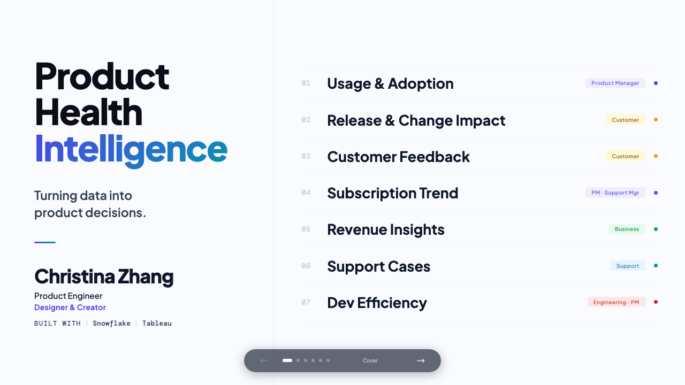
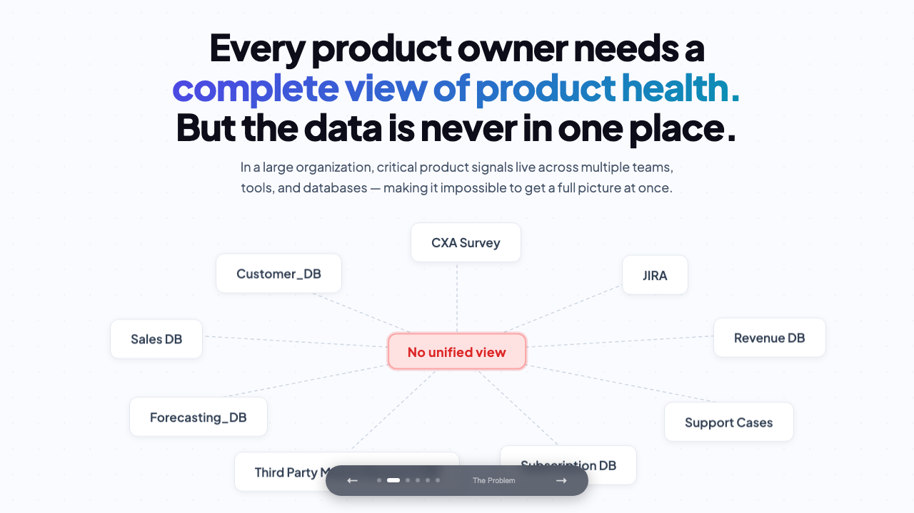

# AI-Powered Product Analytics & Decision Intelligence Platform

## Why This Project

In large product organizations, critical signals like usage telemetry, customer feedback, subscription data, support cases, and engineering metrics are scattered across dozens of tools and databases. No single team has a complete picture of product health.

Product Managers check Tableau for usage. Engineering leads open Jira for bugs and velocity. Support teams track cases in their own system. CTOs and business stakeholders query Snowflake for revenue. By the time insights are stitched together manually, the window for proactive action has already passed.

This project exists to solve that problem: a unified intelligence layer that pulls fragmented data into one coherent view, augmented by AI to surface what matters before it becomes a fire.

## Live Demo

**[View the interactive presentation →](https://christinazhang139.github.io/product-health-monitor/)**

## Key Features

- **Product Adoption & Usage Analytics** — track engagement, activation, and retention metrics
- **Customer Feedback & Support Insights** — synthesize NPS, CSAT, and support ticket patterns
- **Subscription & Revenue Trend Analysis** — monitor MRR, churn, expansion, and cohort performance
- **Release Impact & Engineering Efficiency Tracking** — measure deployment frequency, lead time, and incident response
- **AI-Assisted Business Insight Generation** — surface anomalies, trends, and recommendations automatically

## Tech Stack

`Snowflake` · `Tableau` · `SQL` · `AI Analytics`

## Author

Christina Zhang
